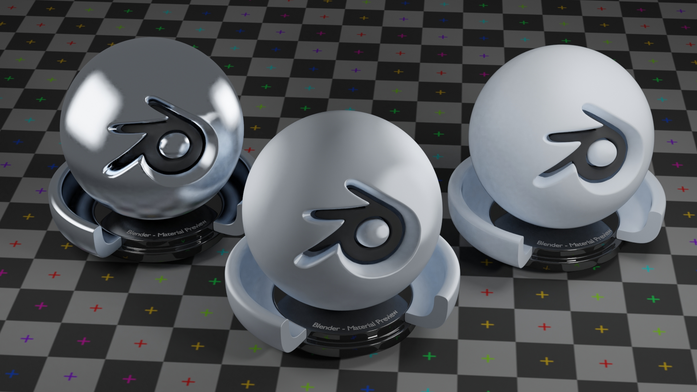
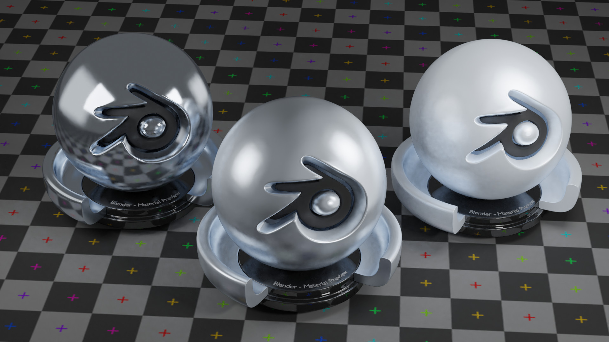
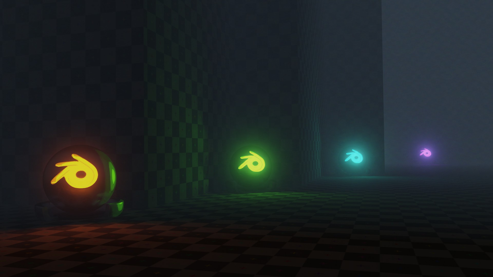

# CMD blender asset repository

A public repository of blender assets created by [cmd410](https://github.com/cmd410) (me). You are free to use this however you wish, I honestly don't give a shit.

## Overview

Here is whats in here...

### Simplistic materials

Simple semi-realistic materials with slight stylization going on

Diffuse:

Metal:

### Fog post-process

A simple, yet, good enough looking fog post-process effect, for those who struggle to render true volumetric fog on their hardware, or for those cases where true fog just doesn't achieve the desired effect. Needs only an **Image** to work on and **Mist pass** from render.

